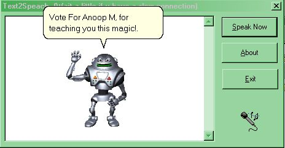



## Text To Speach Conversion : Implementation of MSAgent and T2S Conversion

### Description

Hi Folks: - This project shows you how to implement MSAgent and Text to speach conversion facilities in your VB application and/or web pages. Think about creating talking e-mail apps, talking web pages and text readers. You need MS Agent core components and truevoice text to speach converter for using this code. Download zip and read Readme for more info regarding obtaining them. See my other apps like Icon Hunter and Script Engine for more coding tricks. A little about me; I am looking for creating tie-ups with established US companies for implementing Web Phone services and Voice chat apps using the latest broadcasting technology I developed, and is planning to relocate to US shortly. Kindly visit my website http://www.geocities.com/streamingaudio if u have enough time. If u r a US based developer, I would be gratefull if you can provide me information regarding finding investors/sponsors in US for my ventures. ONE LAST WORD,SEE THE README FILE INCLUDED BEFORE DOING ANYTHING, AND VOTE FOR ME IF YOU FIND THIS COOL.. : Regards, Anoop M Nedumkunnam, anoopj12@angelfire.com
 
### More Info
 

             |
---                |---
**Submitted On**   |2000-06-01 00:13:52
**By**             |[Anoop Madhusudanan](https://github.com/Planet-Source-Code/PSCIndex/blob/master/ByAuthor/anoop-madhusudanan.md)
**Level**          |Intermediate
**User Rating**    |4.9 (44 globes from 9 users)
**Compatibility**  |VB 5\.0, VB 6\.0, VB Script
**Category**       |[Complete Applications](https://github.com/Planet-Source-Code/PSCIndex/blob/master/ByCategory/complete-applications__1-27.md)
**World**          |[Visual Basic](https://github.com/Planet-Source-Code/PSCIndex/blob/master/ByWorld/visual-basic.md)
**Archive File**   |[CODE\_UPLOAD62675312000\.zip](https://github.com/Planet-Source-Code/anoop-madhusudanan-text-to-speach-conversion-implementation-of-msagent-and-t2s-conversion__1-8498/archive/master.zip)

